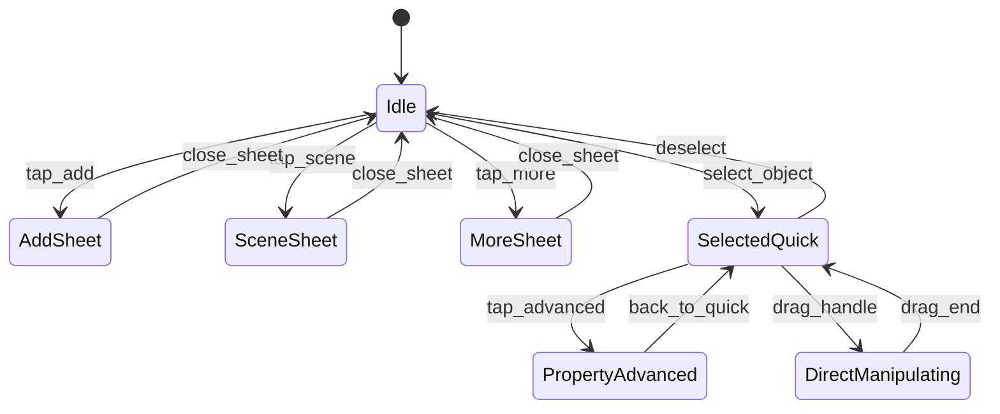

# 手机交互与 UI 设计 V2（含 real/display 全几何尺寸编辑）

Date: 2026-02-27  
Status: Confirmed for implementation

## 1. 目标

本设计用于解决当前手机端“能做但不好做”的问题，重点是：

1. 让手机端主操作回路更短（添加 -> 选中 -> 编辑 -> 观察）。
2. 保留并强化现有触控能力（拖拽、长按、双指）。
3. 统一几何尺寸编辑模型：所有几何字段都支持 `real` + `display` 双轨。
4. 支持直接编辑：手柄拖拽优先改 `display`，不强依赖表单。

## 2. 外部交互参考结论

结合 PhET、EveryCircuit、phyphox、Elloveo 的手机交互，抽象出本项目可用原则：

1. 画布优先：主屏幕不应被参数控件占据。
2. 单一主动作：运行控制必须常驻且易触达。
3. 进阶收纳：低频控制进入 sheet，不挤压主流程。
4. 直接操作优先于表单：对象拖、拉、旋的反馈优先。

## 3. 当前应用定位

当前项目已具备手机核心交互能力，但入口分散：

1. 头部并列多个按钮和面板开关，信息密度高。
2. 触控编辑能力在引擎层存在，但 UI 入口不直观。
3. 属性面板为通用表单，手机场景下编辑链路偏长。

结论：主要短板在“交互壳层设计”，不是底层能力缺失。

## 4. 手机信息架构（IA）

### 4.1 顶部区（精简）

仅保留：

1. 左：场景名/模式标签（演示、编辑）。
2. 中：状态芯片（FPS、对象数，可折叠）。
3. 右：播放悬浮主按钮（也可置于底部中央，见下）。

### 4.2 底部主导航（四分区）

固定底栏 4 项 + 中央主按钮：

1. `添加`：对象库 sheet。
2. `选中`：选中对象快捷编辑 sheet（无选中则置灰）。
3. `场景`：全局参数（重力、边界、时间步长、比例尺）。
4. `更多`：导入/导出/主题/变量/题板。
5. 中央悬浮 `播放/暂停`（优先级最高）。

## 5. 低保真线框

### 5.1 主画布页（Phone）

```text
┌──────────────────────────────────────────┐
│ 编辑模式      FPS 60   对象 5    [▶︎]    │
├──────────────────────────────────────────┤
│                                          │
│               Canvas Area                │
│                                          │
│      (对象选中后显示手柄和测量浮层)      │
│                                          │
├──────────────────────────────────────────┤
│ [添加]      [选中]      [场景]      [更多] │
└──────────────────────────────────────────┘
```

### 5.2 添加对象 Sheet

```text
┌──────────────────────────────────────────┐
│ 添加对象                                  │
│ [搜索框............]                      │
│ 电场: [均匀] [圆形] [半圆] [电容器]       │
│ 磁场: [矩形] [长条] [圆形] [三角]         │
│ 粒子: [粒子] [电子枪] [发射器]            │
│ 显示: [消失区域]                          │
└──────────────────────────────────────────┘
```

### 5.3 选中对象快捷编辑 Sheet

```text
┌──────────────────────────────────────────┐
│ 匀强磁场（圆形）        [复制] [删除]      │
│ ─ 常用 ─                                  │
│ 强度 B:   [ 0.5      ]                    │
│ shape:    [ circle  ▾]                    │
│ radius.real:    [ 1.00 ] m                │
│ radius.display: [ 120  ] px               │
│ 局部比例尺 scale: [1.20]                  │
│ [高级属性]                                │
└──────────────────────────────────────────┘
```

## 6. 交互模型

### 6.1 单指与双指规则

1. 单指点对象：选中。
2. 单指拖对象：移动对象。
3. 单指拖空白：平移画布。
4. 双指拖拽：平移画布。
5. 双指捏合：缩放画布（编辑/演示模式统一支持）。

### 6.2 直接编辑优先

1. 选中对象后，显示放大触控手柄（>= 20px）。
2. 拖拽几何手柄时，优先改 `display`。
3. 画布浮层实时显示：`real`、`display`、`scale`。
4. 结束拖拽后自动同步属性草稿值。

### 6.3 快捷动作

1. 点击对象：只选中，不直接开完整属性。
2. 长按对象：直接打开“选中对象快捷编辑 sheet”。
3. 快捷 sheet 顶部常驻 `复制`、`删除`。

## 7. real/display 全几何尺寸规范

### 7.1 定义

1. `real`：真实尺寸，不受场景缩放影响。
2. `display`：显示尺寸，受场景缩放和对象局部比例尺影响。
3. `objectScale`：对象局部比例尺，只影响该对象 display，不影响 real。

### 7.2 关系

`display = real × sceneScale × objectScale`

### 7.3 编辑语义

1. 编辑 `real`：更新真实尺寸，并重算 display。
2. 编辑 `display`：只反推当前对象 `objectScale`，real 不变。
3. 拖手柄：等同“编辑 display”。
4. 所有几何字段统一执行该语义（`width/height/radius/length/plateDistance/depth/viewGap/spotSize/lineWidth/particleRadius/barrelLength`）。

### 7.4 默认值

本次改动不要求兼容旧语义，默认以新模型初始化：

1. 所有几何字段 `real` 统一默认 `1`（本次改动不做兼容迁移）。
2. `objectScale` 默认 `1`。

## 8. UI 状态机（手机壳层）



## 9. 与现有代码映射

### 9.1 新增组件建议

1. `frontend/src/components/PhoneBottomNav.vue`
2. `frontend/src/components/PhoneAddSheet.vue`
3. `frontend/src/components/PhoneQuickInspector.vue`
4. `frontend/src/components/PhoneSceneSheet.vue`
5. `frontend/src/components/PhoneMoreSheet.vue`
6. `frontend/src/components/GeometryOverlayBadge.vue`

### 9.2 现有组件职责调整

1. `App.vue`：从“手机按钮开关集合”改为“底部导航状态编排”。
2. `PropertyDrawer.vue`：保留高级编辑，不再承担手机首层编辑入口。
3. `ToolbarPanel.vue`：保留桌面主入口；手机改由 `PhoneAddSheet` 驱动。

### 9.3 状态字段建议（Pinia）

1. `phoneActiveSheet: 'add' | 'selected' | 'scene' | 'more' | null`
2. `phoneInspectorLevel: 'quick' | 'advanced'`
3. `phonePlayFabVisible: boolean`
4. `isDirectManipulatingGeometry: boolean`

## 10. 分阶段实施清单

### Phase 1（P0）

1. 上线底部导航壳层与 4 个 sheet 入口。
2. 跑通“添加 -> 选中 -> 快捷编辑 -> 删除/复制”完整链路。
3. 选中对象显示快捷编辑 sheet（替代头部入口依赖）。

### Phase 2（P0）

1. 接入 real/display 双字段在快捷编辑中的展示与编辑。
2. 接入直接拖拽手柄改 `display`，实时浮层显示三元值。
3. 双指缩放从演示模式扩展到编辑模式。

### Phase 3（P1）

1. 高级属性分组压缩与“最近编辑字段”记忆。
2. 加入教学态预设快捷入口（可选）。
3. 完整补齐 phone E2E 场景。

## 11. 验收标准

1. 390px 宽度下主流程可单手完成，不依赖横向滚动。
2. 手机端可完成 create/edit/duplicate/delete 全流程。
3. 所有几何字段支持 real/display 双轨，且 display 改动不影响 real。
4. 直接拖拽几何手柄只影响当前对象局部比例尺。
5. 播放控制始终可见、单击可达。
